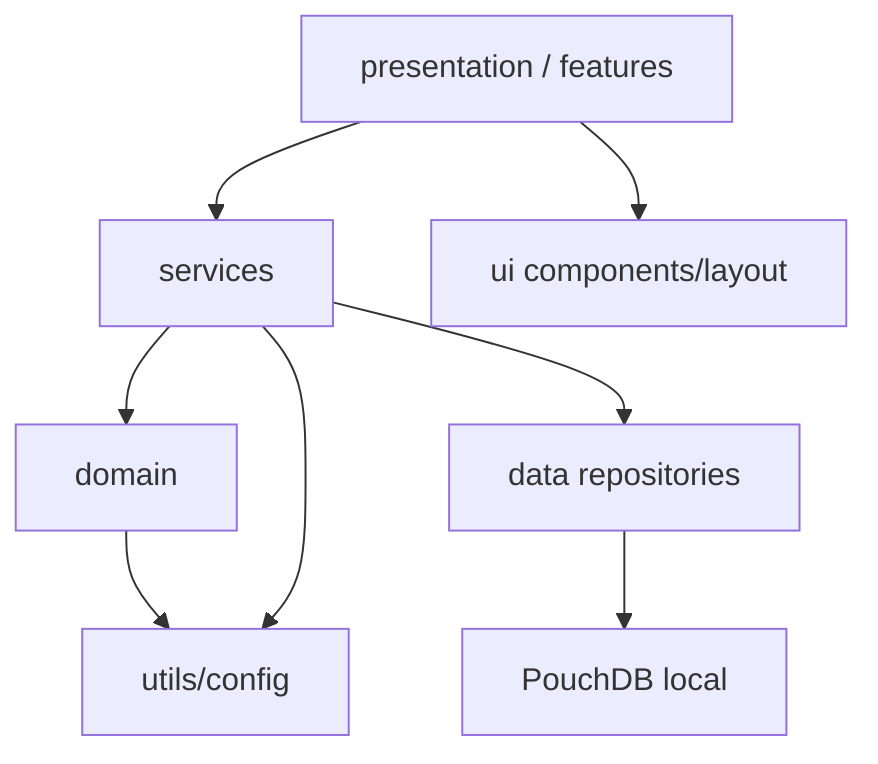

# Arquitetura

O projeto e um PWA estatico sem build step. Ele roda no GitHub Pages e usa PouchDB no navegador como banco local.

## Camadas

### presentation

Fica em `src/features` e `src/ui`.

- `features/*View.js`: HTML declarativo por tela.
- `features/*Controller.js`: escuta eventos de DOM e chama services.
- `ui/components`: componentes pequenos reutilizaveis.
- `ui/layout`: shell, header e navegacao inferior.

### domain

Fica em `src/domain`.

- `eventRules.js`: abertura, prazo e fechamento.
- `scoreRules.js`: pontos, XP e sidekick.
- `validationRules.js`: codigo, expiração e uso unico.
- `rankingRules.js`: agregacao e desempate.
- `achievementRules.js`: conquistas desbloqueaveis.
- `levelRules.js`: nivel e titulos.

### data

Fica em `src/data`.

- `db.js`: inicializacao e helpers PouchDB.
- Repositories por documento.
- `syncAdapter.js`: contrato futuro para Firebase/Supabase.

### services

Fica em `src/services`.

- `geoService.js`: navegador, distancia e tolerancia.
- `codeService.js`: fluxo de pedido, geracao, consumo e progressao.
- `eventService.js`: evento ativo, participantes, fechamento e ranking.
- `pwaService.js`: service worker e estado online/offline.
- `avatarService.js`: avatar automatico.
- `notificationService.js`: feedback visual.

### utils

Funcoes pequenas e estaveis: ids, datas, storage, formatacao, constantes e validadores.

## Fluxo de dependencia

## Offline-first

O service worker cacheia `index.html`, CSS, modulos JS, SVGs e o PouchDB da CDN. Dados de usuario ficam no IndexedDB via PouchDB.

Na primeira abertura, a CDN precisa estar disponivel. Depois do cache inicial, a aplicacao continua abrindo offline.
